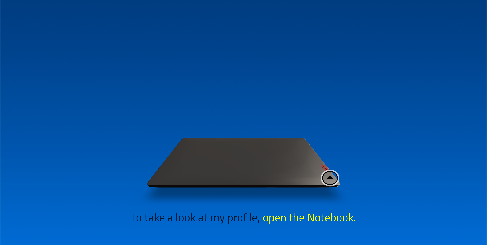
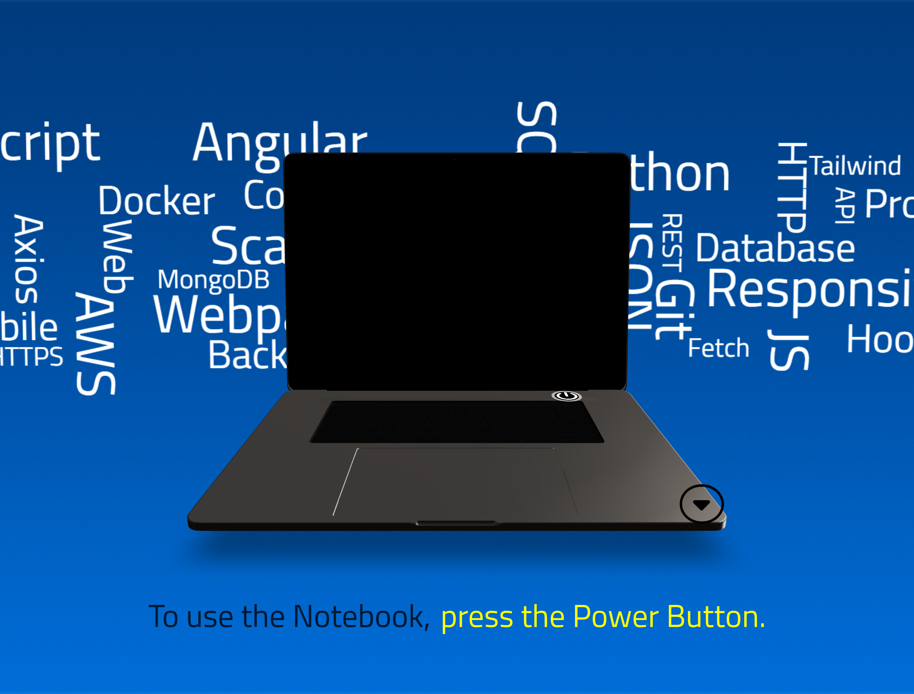
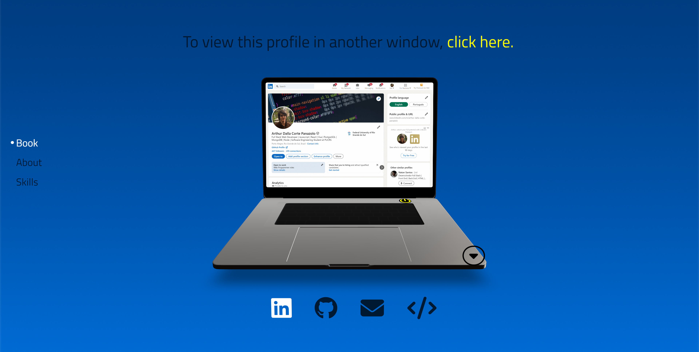
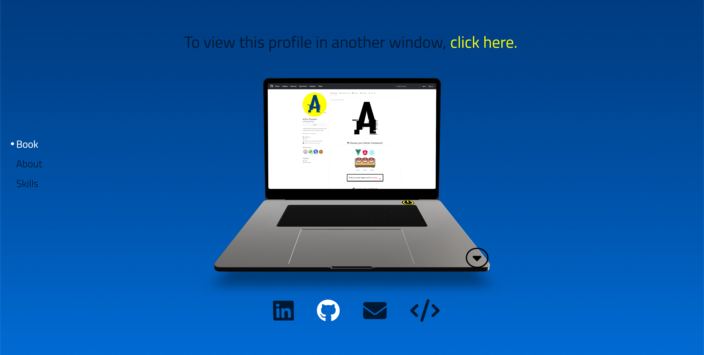
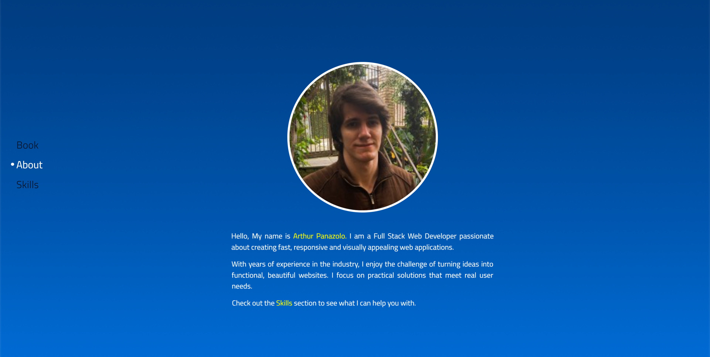
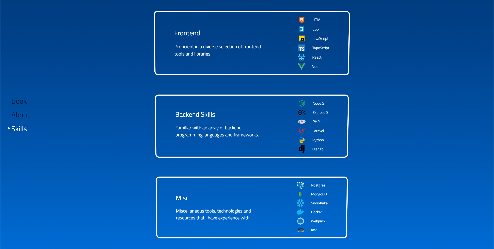

<h1 align="center">R3F Portfolio</h1>


<p align="center">
  
  <br>
  <i>Interactive Portfolio page built with ThreeJS and React Three Fiber libraries
    </i>
  <br>
</p>


<p align="center">
  <a href="https://arthur-panazolo.netlify.app/" target="_blank" rel="noreferrer noopener"><strong>https://arthur-panazolo.netlify.app/</strong></a>
  <br>
</p>


## Introduction









After postponing it for so long, finally made up my mind and decided to create my personal portfolio. This Single Page Application serves as a showcase of my skills and experience in web development. 
With a modern design and interactive elements, I aimed to reflect my passion for coding and creativity, while maintaining a simple and elegant appearance.

Leveraging technologies like React, ThreeJS and React Three Fiber, I focused on delivering a smooth interactive 3D experience, along with responsiveness for various devices. 

React's `useState()` hook and the Zustand library were used to manage the many states of the app (the notebook's open/close and on/off states; also the management of the other pages, "About" and "Skills"), and the 
animations of the notebook and room's pages were made possible by the Gsap library and React Three Fiber's `useFrame()` hook. 

Also worthy of note is the `react-three/drei` library, developed by the open source developer collective 
Pmndrs, which sped up the development of the project considerably, thanks to its extremely useful helpers (components like &lt;Center&gt;, &lt;Environment&gt;, &lt;Billboard&gt; and &lt;Html&gt;, among many others).

Due to several issues that needed to be ironed out, the project took quite some time to finish. To ensure a working design in most devices, many techniques were used (such as the usage and management of the &lt;Bounds&gt; Drei component).

Another challenge was the interaction of the React Three Fiber library with other libraries (like `react-wordcloud`), which led to performance issues. These were addressed through extensive tweaking and debugging, with the help of the Leva GUI component.

The interactive background component, composed of many words in a single block, was made possible by the `react-wordcloud` library, which randomizes each word's position, before joining them all together.
The end goal was to generate something like <a href="https://github.com/nothingnothings/r3f-portfolio/blob/master/wordcloud.jpg" target="_blank" rel="noreferrer noopener">this</a>.

The app was deployed with the help of Netlify, and can be accessed <a href="https://arthur-panazolo.netlify.app/" target="_blank" rel="noreferrer noopener">here</a>.


[](https://github.com/nothingnothings/r3f-portfolio)
[](https://github.com/nothingnothings/r3f-portfolio/blob/master/README.pt-br.md)


 
## Technologies
 
Some of the languages and libraries that were used:
 
- Node Package Manager (bootstrapping and managing the React application)
- HTML5 (with JSX, due to React)
- CSS3 (animations, Flexbox, media queries)
- ReactJS (JavaScript library/framework, app composed entirely of React components)
- ThreeJS (for creating the canvas element where the whole experience is rendered)
- React Three Fiber (library that wraps the ThreeJS library and assists with its integration with the React library)
- State management (two main states: first the central one, maanged by the `zustand` library, in `store/useNotebook.jsx`, used all over the app, then a collection of local states, created via the `useState` hook and present in components like &lt;Room&gt;, &lt;AboutMe&gt;, &lt;Skills&gt; and &lt;PageButtonsHub&gt;)
- Leva (Powerful GUI component that was used to tweak positioning, scale and rotation of 3D elements, along with other things)
- React Wordcloud (responsible for generating the Word Cloud background component)
- Gsap (library responsible for animating many 2D and 3D component's css properties)
- Bootstrap (used for the responsive layout of the &lt;AboutMe&gt; and &lt;Skills&gt; Pages)
- FontAwesome (for the icons of the &lt;SocialMediaPanel&gt;)
- Vite (for the bundling of the app)
- Netlify (for the deployment of the app)


## Project Directory Structure

The development environment:

```

.
├── package.json
├── package-lock.json
├── public
│   ├── fontawesome
│   │   ├── css
│   │   │   ├── all.css
│   │   │   ├── all.min.css
│   │   │   ├── brands.css
│   │   │   ├── brands.min.css
│   │   │   ├── fontawesome.css
│   │   │   ├── fontawesome.min.css
│   │   │   ├── regular.css
│   │   │   ├── regular.min.css
│   │   │   ├── solid.css
│   │   │   ├── solid.min.css
│   │   │   ├── svg-with-js.css
│   │   │   ├── svg-with-js.min.css
│   │   │   ├── v4-font-face.css
│   │   │   ├── v4-font-face.min.css
│   │   │   ├── v4-shims.css
│   │   │   ├── v4-shims.min.css
│   │   │   ├── v5-font-face.css
│   │   │   └── v5-font-face.min.css
│   │   └── webfonts
│   │       ├── fa-brands-400.ttf
│   │       ├── fa-brands-400.woff2
│   │       ├── fa-regular-400.ttf
│   │       ├── fa-regular-400.woff2
│   │       ├── fa-solid-900.ttf
│   │       ├── fa-solid-900.woff2
│   │       ├── fa-v4compatibility.ttf
│   │       └── fa-v4compatibility.woff2
│   ├── fonts
│   │   └── titillium-web-v17-latin-regular.woff
│   ├── images
│   │   ├── arthur-panazolo.jpeg
│   │   ├── boot_sequence.gif
│   │   ├── distribution_board_1k.jpg
│   │   ├── linkedin-printscreen.png
│   │   └── mesh-190.png
│   ├── models
│   │   └── lenovo-notebook.glb
│   └── sounds
│       ├── beep.wav
│       └── fan.mp3
├── screenshots
│   └── panazolo-portfolio.png
├── src
│   ├── Components
│   │   ├── Controls
│   │   │   └── PresControls.jsx
│   │   ├── Environment
│   │   │   └── Env.jsx
│   │   ├── ExperienceWrapper
│   │   │   └── ExperienceWrapper.jsx
│   │   ├── FaviconHelper
│   │   │   └── FaviconHelper.jsx
│   │   ├── Lights
│   │   │   └── RectLight.jsx
│   │   ├── LoadingScreen
│   │   │   └── LoadingScreen.jsx
│   │   ├── Notebook
│   │   │   ├── LenovoBook.jsx
│   │   │   └── Screens
│   │   │       └── Screens.jsx
│   │   ├── Room.jsx
│   │   ├── UI
│   │   │   ├── Buttons
│   │   │   │   ├── HingeButtons.jsx
│   │   │   │   ├── PageButtonsHub.jsx
│   │   │   │   ├── PageMoveButton.jsx
│   │   │   │   └── PowerButtons.jsx
│   │   │   ├── Captions
│   │   │   │   └── Captions.jsx
│   │   │   ├── FauxPages
│   │   │   │   └── Pages
│   │   │   │       ├── AboutMe.tsx
│   │   │   │       └── Skills.tsx
│   │   │   └── SocialMediaPanel
│   │   │       └── SocialMediaPanel.jsx
│   │   └── WordCloud
│   │       ├── fonts.css
│   │       ├── parameters
│   │       │   ├── options.jsx
│   │       │   └── words.jsx
│   │       └── WordCloud.jsx
│   ├── Experience.jsx
│   ├── fontawesome.min.css
│   ├── hooks
│   │   └── useFloat.jsx
│   ├── index.html
│   ├── index.jsx
│   ├── store
│   │   └── useNotebook.jsx
│   ├── style.css
│   └── Utils
│       └── utils.jsx
└── vite.config.js


```


## Project Configuration Files (package.json and vite.config.js)


The `package.json` file used in the project:


```

{
  "name": "panazolo-portfolio",
  "private": true,
  "version": "0.0.0",
  "type": "module",
  "scripts": {
    "dev": "vite",
    "build": "vite build"
  },
  "devDependencies": {
    "@types/react": "^18.3.11",
    "@types/react-dom": "^18.3.0",
    "@vitejs/plugin-react": "4.1",
    "typescript": "^5.6.2",
    "vite": "^4.5.0",
    "vite-plugin-node-polyfills": "^0.22.0"
  },
  "dependencies": {
    "@fortawesome/fontawesome-svg-core": "^6.6.0",
    "@fortawesome/free-brands-svg-icons": "^6.6.0",
    "@fortawesome/free-solid-svg-icons": "^6.6.0",
    "@fortawesome/react-fontawesome": "^0.2.2",
    "@react-three/drei": "^9.88.7",
    "@react-three/fiber": "^8.15.8",
    "bootstrap": "^5.3.3",
    "gsap": "^3.12.5",
    "leva": "^0.8.0",
    "react": "18.2",
    "react-dom": "18.2",
    "react-favicon": "^2.0.7",
    "react-lazy-no-flicker": "^2.1.0",
    "react-wordcloud": "^1.2.7",
    "three": "^0.163.0",
    "zustand": "^4.5.4"
  }
}


```


The vite.config.js file used in the project:


```

import { defineConfig } from 'vite';
import react from '@vitejs/plugin-react';
import { nodePolyfills } from 'vite-plugin-node-polyfills';

export default defineConfig({
  root: 'src/',
  publicDir: '../public/',
  base: '/',
  plugins: [
    react(), // React support
    nodePolyfills(), // Fix Crypto warnings
  ],
  server: {
    host: true, // Open to local network and display URL
    open: !('SANDBOX_URL' in process.env || 'CODESANDBOX_HOST' in process.env), // Open if it's not a CodeSandbox
  },
  build: {
    outDir: '../dist', // Output in the dist/ folder
    emptyOutDir: true, // Empty the folder first
    sourcemap: true, // Add sourcemap
  },
});

```


## Installation/Usage


To use this project, clone it using Git:

1. Run `git clone` to clone the project into your local Git repository.
2. Run `npm install --legacy-peer-deps` to install all dependencies (`react`, `three`, `react-three/fiber`, `react-three/drei`, `gsap`, etc.).
3. Run `npm run build` to create the production/deployment version of the application (outputted in the `/build` directory).
4. Serve the production/deployment files locally or on the web (with the help of a hosting service).
5. Open and power on the notebook model
6. View different pages in the notebook by using the social icons below the notebook
7. View the "About" and "Skills" pages by pressing the buttons to the left of the notebook.


## Features

- Single-page application with no page reloads, using a single HTML file (ReactJS).
- App powered by ThreeJS and React Three fiber, for an interactive 3D user experience.
- Application divided into various components, some of which are reused across multiple places (design philosophy of the ReactJS library).
- Custom CSS design.
- Responsive design (adaptive, supporting mobile and desktop devices) created with Bootstrap, Flexbox, media queries and the &lt;Bounds&gt; Drei component)
- Utilization of core features of the ReactJS library, such as the hooks `useState()` and `useEffect()`.
- Usage of the Zustand library for managing the application's global state
- Leveraging of the Gsap library, for the handling of the page switch animations, notebook opening and closing, powering on and off, etc.

## License

This project is licensed under the MIT License. See the [LICENSE](#) file for more details.
