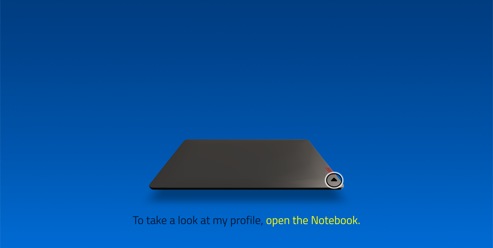
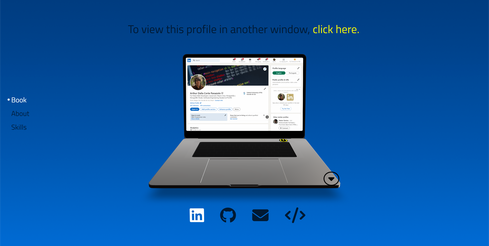
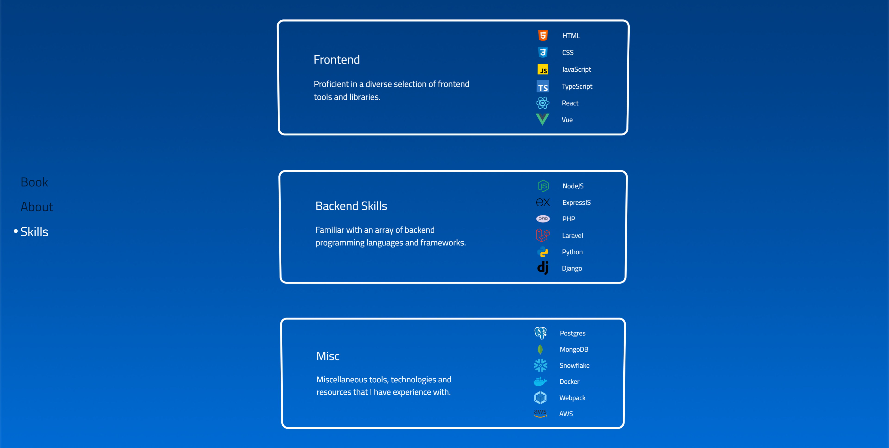

<h1 align="center">R3F Portfolio</h1>

<p align="center">
  
  <br>
  <i>Página de portfólio interativa construída com as bibliotecas ThreeJS e React Three Fiber</i>
  <br>
</p>


<p align="center">
  <a href="https://arthur-panazolo.netlify.app/" target="_blank" rel="noreferrer noopener"><strong>https://arthur-panazolo.netlify.app/</strong></a>
  <br>
</p>


## Introdução









Depois de adiar a tarefa por tanto tempo, finalmente decidi criar meu portfólio pessoal. Esta aplicação de página única serve como uma demonstração das minhas habilidades e experiência em desenvolvimento web. Com um design moderno e elementos interativos, o objetivo foi refletir minha paixão por programação e criatividade e, ao mesmo tempo, construir algo simples e elegante.

Utilizando tecnologias como React, ThreeJS e React Three Fiber, foquei em proporcionar uma experiência 3D interativa, fluída e responsiva. O hook `useState()` do React e o pacote Zustand foram utilizados para gerenciar os slices de state da aplicação (como as animações de abrir/fechar do notebook e o controle de páginas como "AboutMe" e "Skills"). As animações do notebook e das páginas do ambiente foram desenvolvidas com a ajuda da biblioteca Gsap e o hook `useFrame()` do React Three Fiber.

Também merece destaque a biblioteca `react-three/drei`, desenvolvida pela iniciativa de código aberto Pmndrs, que acelerou bastante o desenvolvimento do projeto com seus componentes extremamente úteis, como &lt;Center&gt;, &lt;Environment&gt;, &lt;Billboard&gt; e &lt;Html&gt;, entre outros.

Devido a vários desafios, o projeto levou tempo para ser finalizado. Diversas técnicas foram utilizadas para garantir um design funcional na maioria dos dispositivos (como o uso do componente &lt;Bounds&gt; do Drei). Outro desafio foi a interação da biblioteca React Three Fiber com outras bibliotecas, como `react-wordcloud`, o que ocasionou problemas de desempenho, resolvidos com a ajuda do componente GUI Leva.

O componente de fundo interativo, composto por várias palavras, foi criado com a biblioteca `react-wordcloud`, que randomiza a posição de cada palavra antes de uni-las. O objetivo final era gerar algo similar a <a href="https://github.com/nothingnothings/r3f-portfolio/blob/master/wordcloud.jpg" target="_blank" rel="noreferrer noopener">este exemplo</a>.

O deploy foi realizado com a ajuda do Netlify, e o app pode ser acessado <a href="https://arthur-panazolo.netlify.app/" target="_blank" rel="noreferrer noopener">aqui</a>.

[](https://github.com/nothingnothings/r3f-portfolio)  
[](https://github.com/nothingnothings/r3f-portfolio/blob/master/README.pt-br.md)


## Tecnologias


Algumas das linguagens e bibliotecas utilizadas:

- Node Package Manager (para inicializar e gerenciar o aplicativo React)
- HTML5 (com JSX, devido ao React)
- CSS3 (animações, Flexbox, media queries)
- ReactJS (biblioteca/framework JavaScript, aplicação composta inteiramente de componentes React)
- ThreeJS (para criar o elemento canvas onde toda a experiência é renderizada)
- React Three Fiber (biblioteca que integra o ThreeJS com o React)
- Gerenciamento de state (dois states principais: primeiro o estado central, gerenciado pela biblioteca `zustand`, em `store/useNotebook.jsx`, utilizado em toda a aplicação, e depois uma coleção de states locais, criados com o hook `useState` e presentes em componentes como &lt;Room&gt;, &lt;AboutMe&gt;, &lt;Skills&gt; e &lt;PageButtonsHub&gt;)
- Leva (componente GUI para ajustes finos de posicionamento e escala)
- React Wordcloud (responsável pela geração do componente de fundo de nuvem de palavras)
- Gsap (biblioteca de animação para componentes 2D e 3D)
- Bootstrap (para layout responsivo das páginas "AboutMe" e "Skills")
- FontAwesome (para os ícones do componente SocialMediaPanel)
- Vite (para o bundling da aplicação)
- Netlify (para o deploy)


## Estrutura de Diretórios do Projeto

O ambiente de desenvolvimento:

```

.
├── package.json
├── package-lock.json
├── public
│   ├── fontawesome
│   │   ├── css
│   │   │   ├── all.css
│   │   │   ├── all.min.css
│   │   │   ├── brands.css
│   │   │   ├── brands.min.css
│   │   │   ├── fontawesome.css
│   │   │   ├── fontawesome.min.css
│   │   │   ├── regular.css
│   │   │   ├── regular.min.css
│   │   │   ├── solid.css
│   │   │   ├── solid.min.css
│   │   │   ├── svg-with-js.css
│   │   │   ├── svg-with-js.min.css
│   │   │   ├── v4-font-face.css
│   │   │   ├── v4-font-face.min.css
│   │   │   ├── v4-shims.css
│   │   │   ├── v4-shims.min.css
│   │   │   ├── v5-font-face.css
│   │   │   └── v5-font-face.min.css
│   │   └── webfonts
│   │       ├── fa-brands-400.ttf
│   │       ├── fa-brands-400.woff2
│   │       ├── fa-regular-400.ttf
│   │       ├── fa-regular-400.woff2
│   │       ├── fa-solid-900.ttf
│   │       ├── fa-solid-900.woff2
│   │       ├── fa-v4compatibility.ttf
│   │       └── fa-v4compatibility.woff2
│   ├── fonts
│   │   └── titillium-web-v17-latin-regular.woff
│   ├── images
│   │   ├── arthur-panazolo.jpeg
│   │   ├── boot_sequence.gif
│   │   ├── distribution_board_1k.jpg
│   │   ├── linkedin-printscreen.png
│   │   └── mesh-190.png
│   ├── models
│   │   └── lenovo-notebook.glb
│   └── sounds
│       ├── beep.wav
│       └── fan.mp3
├── screenshots
│   └── panazolo-portfolio.png
├── src
│   ├── Components
│   │   ├── Controls
│   │   │   └── PresControls.jsx
│   │   ├── Environment
│   │   │   └── Env.jsx
│   │   ├── ExperienceWrapper
│   │   │   └── ExperienceWrapper.jsx
│   │   ├── FaviconHelper
│   │   │   └── FaviconHelper.jsx
│   │   ├── Lights
│   │   │   └── RectLight.jsx
│   │   ├── LoadingScreen
│   │   │   └── LoadingScreen.jsx
│   │   ├── Notebook
│   │   │   ├── LenovoBook.jsx
│   │   │   └── Screens
│   │   │       └── Screens.jsx
│   │   ├── Room.jsx
│   │   ├── UI
│   │   │   ├── Buttons
│   │   │   │   ├── HingeButtons.jsx
│   │   │   │   ├── PageButtonsHub.jsx
│   │   │   │   ├── PageMoveButton.jsx
│   │   │   │   └── PowerButtons.jsx
│   │   │   ├── Captions
│   │   │   │   └── Captions.jsx
│   │   │   ├── FauxPages
│   │   │   │   └── Pages
│   │   │   │       ├── AboutMe.tsx
│   │   │   │       └── Skills.tsx
│   │   │   └── SocialMediaPanel
│   │   │       └── SocialMediaPanel.jsx
│   │   └── WordCloud
│   │       ├── fonts.css
│   │       ├── parameters
│   │       │   ├── options.jsx
│   │       │   └── words.jsx
│   │       └── WordCloud.jsx
│   ├── Experience.jsx
│   ├── fontawesome.min.css
│   ├── hooks
│   │   └── useFloat.jsx
│   ├── index.html
│   ├── index.jsx
│   ├── store
│   │   └── useNotebook.jsx
│   ├── style.css
│   └── Utils
│       └── utils.jsx
└── vite.config.js


```


## Arquivos de Configuração do Projeto (package.json e vite.config.js)


O arquivo `package.json` usado no projeto:


```

{
  "name": "panazolo-portfolio",
  "private": true,
  "version": "0.0.0",
  "type": "module",
  "scripts": {
    "dev": "vite",
    "build": "vite build"
  },
  "devDependencies": {
    "@types/react": "^18.3.11",
    "@types/react-dom": "^18.3.0",
    "@vitejs/plugin-react": "4.1",
    "typescript": "^5.6.2",
    "vite": "^4.5.0",
    "vite-plugin-node-polyfills": "^0.22.0"
  },
  "dependencies": {
    "@fortawesome/fontawesome-svg-core": "^6.6.0",
    "@fortawesome/free-brands-svg-icons": "^6.6.0",
    "@fortawesome/free-solid-svg-icons": "^6.6.0",
    "@fortawesome/react-fontawesome": "^0.2.2",
    "@react-three/drei": "^9.88.7",
    "@react-three/fiber": "^8.15.8",
    "bootstrap": "^5.3.3",
    "gsap": "^3.12.5",
    "leva": "^0.8.0",
    "react": "18.2",
    "react-dom": "18.2",
    "react-favicon": "^2.0.7",
    "react-lazy-no-flicker": "^2.1.0",
    "react-wordcloud": "^1.2.7",
    "three": "^0.163.0",
    "zustand": "^4.5.4"
  }
}


```


O arquivo `vite.config.js` usado no projeto:


```

import { defineConfig } from 'vite';
import react from '@vitejs/plugin-react';
import { nodePolyfills } from 'vite-plugin-node-polyfills';

export default defineConfig({
  root: 'src/',
  publicDir: '../public/',
  base: '/',
  plugins: [
    react(), // React support
    nodePolyfills(), // Fix Crypto warnings
  ],
  server: {
    host: true, // Open to local network and display URL
    open: !('SANDBOX_URL' in process.env || 'CODESANDBOX_HOST' in process.env), // Open if it's not a CodeSandbox
  },
  build: {
    outDir: '../dist', // Output in the dist/ folder
    emptyOutDir: true, // Empty the folder first
    sourcemap: true, // Add sourcemap
  },
});

```


## Instalação/Utilização

Para utilizar este projeto, clone-o usando o Git:

1. Execute `git clone` para clonar o projeto em seu repositório local.
2. Execute `npm install --legacy-peer-deps` para instalar todas as dependências (`react`, `three`, `react-three/fiber`, `react-three/drei`, `gsap`, etc.).
3. Execute `npm run build` para criar a versão de produção/desenvolvimento da aplicação (os arquivos de saída estarão no diretório `/build`).
4. Sirva os arquivos de produção/desenvolvimento localmente ou na web (com a ajuda de um serviço de hospedagem).
5. Abra e ligue o notebook
6. Visualize as diferentes páginas do notebook utilizando os ícones abaixo do notebook.
7. Visualize as páginas "About" e "Skills" pressionando os botões à esquerda do notebook.


## Funcionalidades

- Aplicação de página única (SPA) sem recarregamento, utilizado um único arquivo HTML (ReactJS).
- Aplicação desenvolvida com ThreeJS e React Three Fiber, oferecendo uma experiência interativa 3D.
- Aplicação dividida em vários componentes, alguns dos quais são reutilizados em vários locais (filosofia de design do ReactJS).
- Design customizado com CSS.
- Design responsivo (adaptativo, suportando dispositivos móveis e desktops) criado com Bootstrap, Flexbox, media queries e o componente &lt;Bounds&gt; da biblioteca Drei.
- Utilização de recursos essenciais da biblioteca ReactJS, como os hooks `useState()` e `useEffect()`.
- Uso da biblioteca Zustand para gerenciamento do estado global da aplicação.
- Animações gerenciadas pela biblioteca Gsap, incluindo troca de páginas, abertura e fechamento do notebook, o ligar e o desligar, etc.